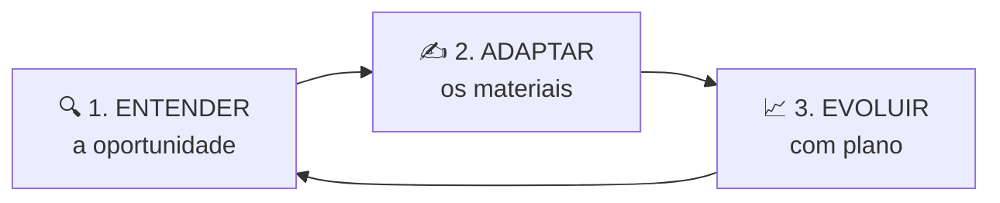

# 🗺 Jornada do Usuário — CareerTwin

> Discovery (3 momentos macro) conectado às telas do produto construído.

## 1. Os três grandes momentos

| Momento | Pergunta do usuário | No produto |
| --- | --- | --- |
| Entender | “Essa vaga/cargo faz sentido pra mim?” | Aba **Aderência** + score |
| Adaptar | “Como contar melhor o que eu já fiz?” | **Recomendações** + **Tradução** |
| Evoluir | “O que faço esta semana?” | **Plano** + reanálise |

## 2. Jornada detalhada

### Fase 0 — Antes do produto

| | |
| --- | --- |
| **Situação** | Desempregado, aviso prévio ou insatisfeito; candidaturas em massa |
| **Pensa** | “Não sei o que está errado” |
| **Sente** | Ansiedade, perda de confiança |
| **Implicação** | Tom **acolhedor**, sem julgar; nunca culpar |

### Fase 1 — Descoberta (Landing `/`)

| | |
| --- | --- |
| **Faz** | Lê proposta, vê logo e CTAs |
| **Pensa** | “Mais uma IA genérica?” |
| **Produto** | Hero com marca, honestidade, “sem promessas de contratação” |
| **Risco** | Parecer job board ou gerador de CV fake |
| **Oportunidade** | Diferencial: autenticidade + plano |

### Fase 2 — Conta (`/cadastro`, `/login`)

| | |
| --- | --- |
| **Faz** | Cria conta e-mail/senha |
| **Fricção** | Confirm email / rate limit / domínio rejeitado |
| **Mitigação** | Confirm OFF em teste; orientar Gmail |

### Fase 3 — Dashboard vazio → primeira análise

| | |
| --- | --- |
| **Faz** | Clica “Criar primeira análise” |
| **Pensa** | “Vai ser demorado / técnico?” |
| **Produto** | Empty state claro + wizard guiado |

### Fase 4 — Wizard (`/analise/nova`)

| Etapa | Usuário faz | Risco de abandono |
| --- | --- | --- |
| Boas-vindas | Entende o que vem | Baixo |
| Currículo | Cola texto / upload | Médio se só PDF e achar que “leu” |
| LinkedIn | URL + texto | Médio |
| Cargo | Define alvo ou pede sugestão | Baixo |
| Vaga | Opcional | Baixo (pular) |
| Complementos | Opcional | Baixo |
| Revisão | Confirma | Baixo |
| Processamento | Espera | Médio se demorar sem feedback |

**Copy crítica:** “Para a melhor análise, cole também o texto” — honestidade sobre PDF.

### Fase 5 — Resultado (`/analise/[id]`)

| Aba | Momento da jornada | Emoção desejada |
| --- | --- | --- |
| Visão geral | Entender o quadro | “Alguém me entendeu” |
| Recomendações | Adaptar | “Sei por onde começar” |
| Aderência | Entender oportunidade | “Faço sentido (ou não) aqui” |
| Tradução | Adaptar comunicação | “Posso contar melhor sem mentir” |
| Plano | Evoluir | “Tenho tarefas claras” |

**Ações:** marcar recomendação/ação · feedback · reanálise.

### Fase 6 — Retorno e reanálise

| | |
| --- | --- |
| **Faz** | Atualiza materiais, gera nova análise |
| **Vê** | Score anterior × atual, lacunas que restam |
| **Sente** | Progresso (ou foco no que falta) |

## 3. Mapa tela ↔ fase

| Tela | Fases |
| --- | --- |
| `/` | 1 |
| Auth | 2 |
| `/dashboard` | 3, 6 |
| `/analise/nova` | 4 |
| `/analise/[id]` | 5, 6 |
| `/planos` | monetização futura |
| `/configuracoes` | perfil |

## 4. Princípios de UX derivados da jornada

1. Acolher sem prometer milagre  
2. Ser honesto sobre limites (PDF, mock, IA)  
3. Priorizar (impacto × esforço)  
4. Fechar o ciclo (marcar feito → reanalisar)  
5. Dar controle e privacidade  
