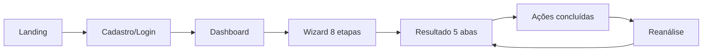

# 📋 Documentação de Produto (PO) — CareerTwin

> **O que** o produto faz e **por quê**. Artefatos irmãos: [One Page](one-page.md) · [Jornada](jornada-usuario.md) · [PRD](prd.md).

## 1. Visão do produto

**Problema:** profissionais brasileiros em recolocação/transição comunicam mal a trajetória real: currículo genérico, LinkedIn fraco, sem clareza de aderência a vagas.

**Proposta de valor:** mentor de carreira com IA que analisa materiais **reais** e devolve:

1. Recomendações priorizadas  
2. Diagnóstico de aderência (score)  
3. Tradução da experiência (com alerta de autenticidade)  
4. Plano de evolução acompanhável  

**Posicionamento:** CareerTwin **não** é gerador de currículo mágico, **não** promete contratação e **não** inventa experiências.

**Tagline de marca:** *Evolua, Reposicione e Conquiste.*

### Métricas sugeridas

| Métrica | Indica |
| --- | --- |
| ⭐ Usuários que concluem 1ª análise | Ativação |
| Recomendações marcadas como feitas | Engajamento |
| Taxa de reanálise | Retenção |
| Δ de score entre versões | Valor mensurável |
| % análises com vaga específica | Profundidade |
| Feedback `util` / `parcial` / `nao_util` | Qualidade percebida |

## 2. Personas

### A — Recolocação urgente
- 25–45 anos, operacional/admin ou similar, desempregado ou aviso prévio  
- Dor: dezenas de candidaturas sem retorno  
- Ganho: saber **o que ajustar primeiro**  

### B — Transição de carreira
- Quer mudar de área/cargo  
- Dor: “não tenho os requisitos” (muitas vezes é comunicação)  
- Ganho: separar lacuna **real** × **comunicação** × **evidência**  

### C — Sênior (ex.: TI) com posicionamento fraco
- Histórico forte, LinkedIn genérico  
- Dor: mercado subestima o perfil  
- Ganho: narrativa e título alinhados à senioridade real  

## 3. Jornada resumida

Detalhe emocional: [jornada-usuario.md](jornada-usuario.md).

## 4. Épicos e user stories (MVP)

### Épico 1 — Conta e acesso
- Como profissional, quero criar conta e entrar para salvar minhas análises.  
- **Aceite:** cadastro, login, logout, redirect de rotas protegidas.

### Épico 2 — Nova análise
- Como usuário, quero enviar currículo, LinkedIn e cargo-alvo (vaga opcional) e gerar análise.  
- **Aceite:** wizard 8 etapas; texto colado obrigatório para qualidade; arquivos no Storage; status processing → completed.

### Épico 3 — Resultado estruturado
- Como usuário, quero ver diagnóstico em abas acionáveis.  
- **Aceite:** Visão geral, Recomendações (filtro + marcar feita), Aderência, Tradução (alerta autenticidade), Plano (marcar concluída).

### Épico 4 — Histórico e reanálise
- Como usuário, quero ver análises anteriores e comparar evolução.  
- **Aceite:** dashboard com lista; reanálise pré-preenchida; comparativo de score quando houver `analysis_versions`.

### Épico 5 — Confiança e validação
- Como time de produto, quero feedback e nota de confiança.  
- **Aceite:** `confidence` na análise; `analysis_feedback` no final do resultado.

### Épico 6 — Freemium (estrutura)
- Como negócio, quero tela de planos preparada.  
- **Aceite:** UI de planos + tabelas `plans`/`user_credits`; **sem** checkout real.

## 5. Regras de ouro (não negociáveis)

1. Não inventar experiência  
2. Não criar métricas falsas  
3. Não prometer contratação  
4. Diferenciar lacunas real / comunicação / evidência  
5. Enums no banco sem acento; labels na UI  

## 6. Fora de escopo (MVP)

Checkout · scraping LinkedIn · parser PDF robusto · job board · mock interview · B2B RH · app mobile nativo  

## 7. Status de implementação

| Capacidade | Status |
| --- | --- |
| Auth Supabase | ✅ |
| Wizard + Storage | ✅ |
| IA mock + schema Zod | ✅ |
| Providers xAI / OpenAI | ✅ (env) |
| 5 abas + marcar feitos | ✅ |
| Reanálise + versões | ✅ |
| Jargões por área | ✅ |
| Planos freemium UI | ✅ |
| Pagamento | ❌ |
| Parser PDF | ❌ (honesto na UI) |
